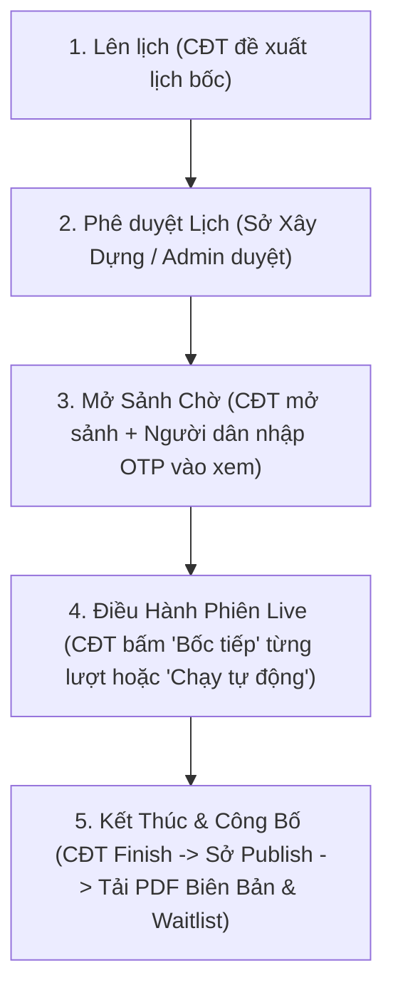

# 🎲 Tài Liệu Hướng Dẫn Tích Hợp API Nghiệp Vụ Bốc Thăm (Chế Độ Chủ Đầu Tư Điều Hành)

Tài liệu này chi tiết toàn bộ các API, SignalR WebSocket Hub, phân quyền Role và quy trình nghiệp vụ Bốc thăm quyền mua Nhà ở Xã hội (NOXH) theo **Nghị định 100/2024/NĐ-CP (Điều 36 & 38.2)** được chuẩn hóa theo **Chế độ Chủ đầu tư điều hành (Operator Mode)**.

> 1. **Màn hình Người dân (Applicant)**: 
>    * Người dân đăng nhập bằng mã OTP vào sảnh chờ (`verify-otp` hoặc SignalR `JoinProjectLobby`).
>    * Màn hình người dân đóng vai trò **Khán phòng theo dõi trực tuyến (Live Lobby View)**. Khi kết quả bốc thăm của từng người nhảy ra, màn hình người dân tự động cập nhật bảng kết quả và thông báo trúng/trượt thời gian thực via SignalR.
> 
> 2. **Màn hình Chủ đầu tư (CĐT - HousingDeveloper)**:
>    * Là **Bàn điều khiển phiên (Host Console)** duy nhất.
>    * CĐT bấm nút **"Bốc tiếp" (`POST /draw-next`)** để hệ thống lần lượt chọn người dân tiếp theo trong danh sách chờ và thực hiện quay số cho họ.
>    * HOẶC CĐT bấm **"Chạy bốc thăm tự động" (`POST /run`)** để hệ thống tự động chạy thuật toán xáo trộn Fisher-Yates phân bổ căn cho toàn bộ sảnh theo đúng tỷ lệ ưu tiên Điều 38.2.
>    * CĐT điều khiển Tạm dừng (`pause`), Tiếp tục (`resume`), Kết thúc phiên (`finish`).
> 
> 3. **Màn hình Sở Xây dựng (SXD - DepartmentOfConstruction) / Admin**:
>    * Tham gia sảnh với vai trò **Giám sát trực tuyến** (Hệ thống đếm số đại diện SXD online theo Đ36.2.b).
>    * Là bên duy nhất có thẩm quyền bấm nút **"Công bố kết quả" (`POST /session/publish`)** và **"Tải Biên bản PDF" (`GET /minutes.pdf`)**.

---

## 📌 Luồng Nghiệp Vụ 5 Giai Đoạn



---

## 🌐 MÔ TẢ CHI TIẾT TẤT CẢ API REST (`/api/projects/{projectId}/lottery`)

Tất cả các API dưới đây yêu cầu Header: `Authorization: Bearer <JWT_TOKEN>` (trừ API xem lịch công khai).

---

### GIAI ĐOẠN 1: QUẢN LÝ LỊCH BỐC THĂM

#### 1. [CĐT] Lên lịch bốc thăm
* **API Route**: `POST /api/projects/{projectId}/lottery/schedule`
* **Quyền (Role)**: `HousingDeveloper` (Chủ đầu tư)
* **Mục đích**: CĐT đề xuất ngày giờ, địa điểm/link hội trường trực tuyến và số lượng suất căn hộ đưa ra bốc thăm.
* **Input Body (`CreateOrUpdateLotteryScheduleDto`)**:
  ```json
  {
    "lotteryDate": "2026-09-01T09:00:00Z",
    "lotteryLocation": "https://meet.google.com/xyz-abc hoặc Hội trường A",
    "lotteryDescription": "Phiên bốc thăm mở bán Đợt 1 Dự án NHS Trung Văn",
    "totalUnits": 50
  }
  ```
* **Response (200 OK)**: `LotteryScheduleDetailDto` (`sessionStatus = "SCHEDULED"`, `isLotteryApproved = false`).

#### 2. [Sở Xây dựng/Admin] Phê duyệt Lịch Bốc thăm
* **API Route**: `POST /api/projects/{projectId}/lottery/schedule/approve`
* **Quyền (Role)**: `DepartmentOfConstruction`, `SystemAdministrator`
* **Mục đích**: Đơn vị quản lý nhà nước phê duyệt lịch bốc thăm do CĐT đề xuất để mở sảnh công khai.
* **Response (200 OK)**: Trạng thái lịch bốc thăm cập nhật `isLotteryApproved = true`.

#### 3. [Công khai] Xem thông tin Lịch Bốc thăm
* **API Route**: `GET /api/projects/{projectId}/lottery/schedule`
* **Quyền (Role)**: `AllowAnonymous` (Tất cả mọi người)
* **Mục đích**: Người dân và công chúng xem lịch bốc thăm, thời gian, địa điểm tổ chức của dự án.
* **Response (200 OK)**: Chi tiết lịch bốc thăm, tổng số hồ sơ đủ điều kiện và số căn hộ còn lại.

#### 4. [CĐT/Sở/Admin] Xem danh sách hồ sơ đủ điều kiện bốc thăm
* **API Route**: `GET /api/projects/{projectId}/lottery/eligible-participants`
* **Quyền (Role)**: `HousingDeveloper`, `DepartmentOfConstruction`, `SystemAdministrator`
* **Mục đích**: Lấy danh sách toàn bộ người dân có hồ sơ đăng ký đã được Sở Xây dựng duyệt (`APPROVED` hoặc `APPROVED_BY_TIMEOUT`) để chuẩn bị bốc thăm.

---

### GIAI ĐOẠN 2: THAO TÁC SẢNH CHỜ (WAITING LOBBY)

#### 5. [CĐT] Mở sảnh chờ (Open Lobby)
* **API Route**: `POST /api/projects/{projectId}/lottery/session/open-lobby`
* **Quyền (Role)**: `HousingDeveloper`
* **Mục đích**: CĐT kích hoạt mở sảnh chờ trực tuyến. Hệ thống tạo mã OTP JoinCode tham dự sảnh cho người dân.
* **Response (200 OK)**: Mã trạng thái phiên chuyển thành `WAITING_LOBBY` kèm mã JoinCode.

#### 6. [Người dân] Xác thực OTP vào sảnh theo dõi
* **API Route**: `POST /api/projects/{projectId}/lottery/session/verify-otp`
* **Quyền (Role)**: `Authorize` (Người dùng đã đăng nhập)
* **Mục đích**: Người dân nhập mã OTP JoinCode để điểm danh có mặt trong sảnh chờ xem Live. (Đại diện CĐT/Sở/Admin không cần mã).
* **Input Body (`JoinLotteryLobbyRequestDto`)**:
  ```json
  {
    "joinCode": "123456"
  }
  ```
* **Response (200 OK)**: Xác nhận điểm danh thành công và trả về dữ liệu trạng thái sảnh.

---

### GIAI ĐOẠN 3: ĐIỀU HÀNH PHIÊN LIVE BỐC THĂM (CĐT THỰC HIỆN)

#### 7. [CĐT] Bắt đầu phiên bốc thăm Live
* **API Route**: `POST /api/projects/{projectId}/lottery/session/start`
* **Quyền (Role)**: `HousingDeveloper`
* **Mục đích**: CĐT bấm bắt đầu chính thức phiên quay số. Trạng thái chuyển sang `LIVE`.

#### 8. [CĐT] Kích hoạt quay số lượt tiếp theo ("Bốc tiếp")
* **API Route**: `POST /api/projects/{projectId}/lottery/draw-next`
* **Quyền (Role)**: `HousingDeveloper` (Chủ đầu tư)
* **Mục đích**: **CĐT bấm nút quay số cho ứng viên tiếp theo trong danh sách chưa bốc**. Hệ thống ngẫu nhiên phân bổ căn hộ/kết quả cho người dân đó và tự động bắn thông báo SignalR `ReceiveDrawResult` trực tiếp lên màn hình tất cả người dân ở sảnh.
* **Response (200 OK)**: `LiveDrawResultDto` chứa thông tin người được bốc, kết quả trúng/trượt và vị trí căn hộ.

#### 9. [CĐT] Chạy bốc thăm tự động hàng loạt (Batch Auto Run)
* **API Route**: `POST /api/projects/{projectId}/lottery/run`
* **Quyền (Role)**: `HousingDeveloper` (Chủ đầu tư)
* **Mục đích**: CĐT bấm nút chạy bốc thăm tự động cho toàn bộ danh sách hồ sơ cùng lúc theo quy định Điều 38.2 NĐ 100/2024 (Áp dụng tỷ lệ ưu tiên + Thuật toán xáo trộn Fisher-Yates).
* **Input Body (`RunLotteryRequestDto`)**:
  ```json
  {
    "totalUnits": 50
  }
  ```
* **Response (200 OK)**: Bảng tổng hợp kết quả bốc thăm toàn bộ dự án.

#### 10. [CĐT] Tạm dừng phiên bốc thăm (Pause)
* **API Route**: `POST /api/projects/{projectId}/lottery/session/pause`
* **Quyền (Role)**: `HousingDeveloper`
* **Mục đích**: CĐT tạm dừng phiên quay số khi cần giải quyết khiếu nại hoặc gián đoạn kỹ thuật. Trạng thái chuyển sang `PAUSED`.

#### 11. [CĐT] Tiếp tục phiên bốc thăm (Resume)
* **API Route**: `POST /api/projects/{projectId}/lottery/session/resume`
* **Quyền (Role)**: `HousingDeveloper`
* **Mục đích**: CĐT cho phiên quay số tiếp tục hoạt động trở lại. Trạng thái chuyển về `LIVE`.

---

### GIAI ĐOẠN 4: KẾT THÚC, CÔNG BỐ KẾT QUẢ & XUẤT BIÊN BẢN

#### 12. [CĐT] Kết thúc phiên bốc thăm (Finish Session)
* **API Route**: `POST /api/projects/{projectId}/lottery/session/finish`
* **Quyền (Role)**: `HousingDeveloper`
* **Mục đích**: CĐT bấm chốt kết thúc phiên. Trạng thái chuyển sang `FINISHED`.
  * Những người bốc trúng: Chuyển sang bước chờ nộp tiền cọc 10%.
  * Những người bốc trượt / chưa bốc: Hệ thống tự động xếp vào **Danh sách chờ (Waitlist)** có số thứ tự dự bị (1, 2, 3...).

#### 13. [Sở Xây dựng/Admin] Công bố kết quả chính thức (Publish Session)
* **API Route**: `POST /api/projects/{projectId}/lottery/session/publish`
* **Quyền (Role)**: `DepartmentOfConstruction`, `SystemAdministrator`
* **Mục đích**: Đơn vị nhà nước phê duyệt và công bố chính thức kết quả bốc thăm lên hệ thống thông tin công cộng theo Điều 36.2.b. CĐT không có quyền tự công bố. Trạng thái chuyển sang `PUBLISHED`.

#### 14. Xem toàn bộ trạng thái màn hình Live (Live State)
* **API Route**: `GET /api/projects/{projectId}/lottery/live-state`
* **Quyền (Role)**: `Authorize`
* **Mục đích**: Lấy toàn bộ dữ liệu 3 khu vực hiển thị trên màn hình sảnh bốc thăm Live:
  * **Khu vực 1**: Sĩ số sảnh, số đại diện Sở Xây dựng đang online giám sát, ứng viên đang được quay lượt này.
  * **Khu vực 2**: Danh sách bảng kết quả bốc thăm vừa diễn ra (Realtime Board).
  * **Khu vực 3**: Thống kê tỷ lệ và quỹ căn hộ còn lại.

#### 15. Xem kết quả bốc thăm mới nhất
* **API Route**: `GET /api/projects/{projectId}/lottery/result`
* **Quyền (Role)**: CĐT, Sở Xây Dựng, Admin, Applicant
* **Mục đích**: Xem bảng tổng hợp kết quả chính thức của phiên bốc thăm đã công bố.

#### 16. [CĐT/Sở/Admin] Tải Biên bản PDF Bốc thăm
* **API Route**: `GET /api/projects/{projectId}/lottery/minutes.pdf`
* **Quyền (Role)**: `HousingDeveloper`, `DepartmentOfConstruction`, `SystemAdministrator`
* **Mục đích**: Tải file PDF biên bản làm việc chính thức của phiên bốc thăm có đầy đủ chữ ký và danh sách người trúng/trượt để lưu trữ pháp lý.

---

### GIAI ĐOẠN 5: QUẢN LÝ DANH SÁCH CHỜ (WAITLIST & ĐÔN SUẤT)

#### 17. Xem Danh sách chờ (Waitlist)
* **API Route**: `GET /api/projects/{projectId}/lottery/waitlist?desiredApartmentTypeId={guid}`
* **Quyền (Role)**: `Authorize`
* **Mục đích**: Xem danh sách ứng viên dự bị (Waitlist) được xếp thứ tự 1, 2, 3... theo từng loại căn hộ cùng hạn chót nộp cọc.

#### 18. [CĐT/Sở/Admin] Đôn ứng viên Waitlist lên trúng mua chính thức
* **API Route**: `POST /api/projects/{projectId}/lottery/promote-waitlist?desiredApartmentTypeId={guid}`
* **Quyền (Role)**: `HousingDeveloper`, `DepartmentOfConstruction`, `SystemAdministrator`
* **Mục đích**: Khi có người trúng mua chính thức bỏ cọc / bị hủy hợp đồng, CĐT/Sở bấm API này để tự động đôn người đứng đầu danh sách chờ (Waitlist #1) lên suất trúng mua chính thức và gia hạn 7 ngày nộp cọc.

---

## 📡 SignalR WebSocket Hub (`/hubs/lottery`)

Frontend kết nối tới SignalR Hub `wss://domain.com/hubs/lottery?access_token=...` để đồng bộ thời gian thực:

### 1. Sự kiện Frontend CĐT gửi lên Server (Client Invokes):
* `JoinProjectLobby(projectId, joinCode)`: Tham gia sảnh bốc thăm.
* `LeaveProjectLobby(projectId)`: Rời sảnh bốc thăm.
* `DrawNextTurn(projectId)`: [CĐT] Kích hoạt quay số lượt tiếp theo.
* `PauseLive(projectId)`: [CĐT] Tạm dừng phiên bốc thăm.
* `ResumeLive(projectId)`: [CĐT] Tiếp tục phiên bốc thăm.

### 2. Sự kiện Server phát xuống cho Người dân & Sảnh xem (Client Event Listeners):
* `ReceiveLobbyCount(onlineCount: number)`: Cập nhật số người đang có mặt trực tuyến ở sảnh.
* `ReceiveSxdSupervisorCount(sxdOnlineCount: number)`: Cập nhật số đại diện Sở Xây dựng đang online giám sát phiên.
* `ReceiveLiveState(state: LotteryLiveStateDto)`: Đồng bộ toàn bộ màn hình sảnh bốc thăm.
* `ReceiveDrawResult(data: LiveDrawResultDto)`: Bắn kết quả vừa quay trúng/trượt tới tất cả màn hình người dân ở sảnh.
* `ReceiveLotteryStatus(statusMessage: string)`: Bắn thông báo đổi trạng thái phiên (`WAITING_LOBBY`, `LIVE`, `PAUSED`, `FINISHED`, `PUBLISHED`).

